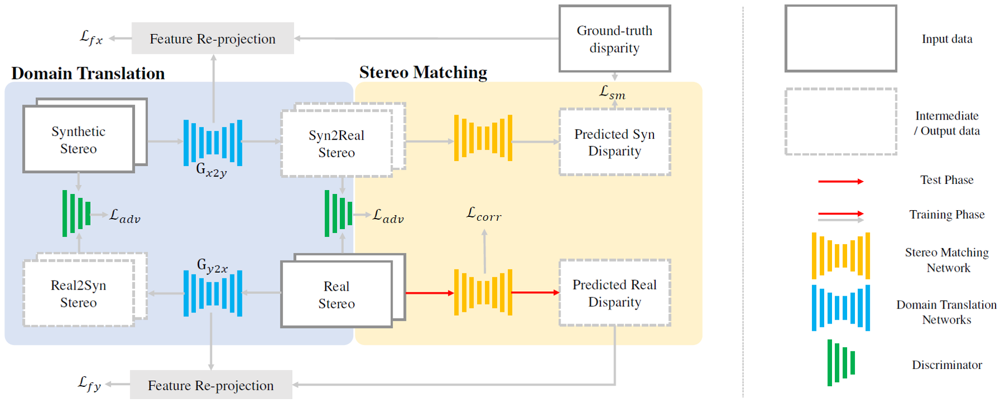

# StereoGAN: Bridging Synthetic-to-Real Domain Gap by Joint Optimization of Domain Translation and Stereo Matching
[CVPR 2020 paper](https://arxiv.org/abs/2005.01927) | [BibeTex](#citation)

## Introduction

We propose an end-to-end training framework with domain translation and stereo matching networks to mitigate the synthetic-to-real domain gap in stereo datasets. First, joint optimization between domain translation and stereo matching networks in our end-to-end framework makes the former facilitate the latter one to the maximum extent. Second, this framework introduces two novel losses, i.e., bidirectional multi-scale feature re-projection loss and correlation consistency loss, to help translate all synthetic stereo images into realistic ones as well as maintain epipolar constraints.



## Training
```
sh run.sh
```

## Citation
```
@InProceedings{Liu_2020_CVPR,
author = {Liu, Rui and Yang, Chengxi and Sun, Wenxiu and Wang, Xiaogang and Li, Hongsheng},
title = {StereoGAN: Bridging Synthetic-to-Real Domain Gap by Joint Optimization of Domain Translation and Stereo Matching},
booktitle = {The IEEE Conference on Computer Vision and Pattern Recognition (CVPR)},
month = {June},
year = {2020}
}
```
